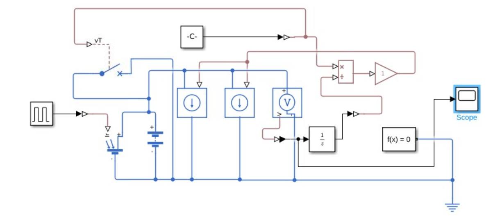
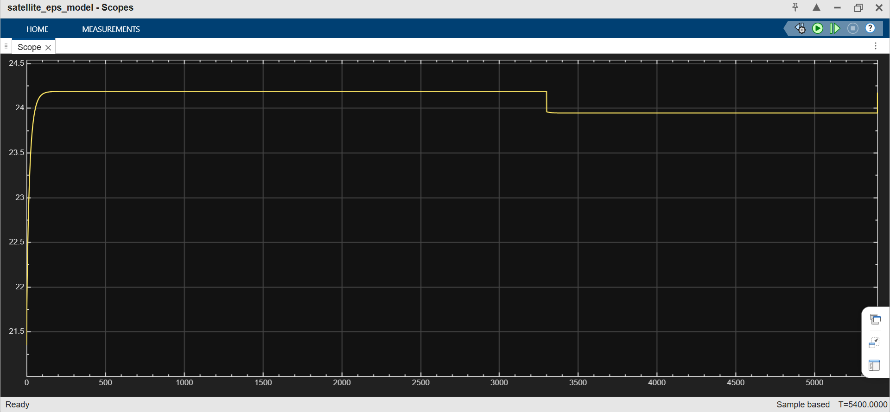

# Satellite Electrical Power System (EPS) Energy Balance Simulation

A high-fidelity dynamic Simscape and Simulink model developed to simulate and verify the power generation, energy storage, and payload distribution network of a Low Earth Orbit (LEO) satellite across a full 5400-second (90-minute) orbit. 

## 🛰️ System Overview
The model simulates a regulated satellite DC power distribution architecture designed to balance varying solar irradiance profiles against a high-power payload duty cycle.

* **Solar Array Subsystem:** Modeled as a controlled current source driven by a discrete pulse profile representing the orbital daylight/eclipse cycle.
* **Energy Storage (Battery Pack):** A Lithium-Ion battery subsystem configured for a nominal $28\text{ V}$ bus, optimized with low internal resistance ($0.02\ \Omega$) to mitigate transient voltage sags during heavy loading.
* **Dynamic Payloads:** Comprises baseline system loads and a high-power imaging payload managed via an automated, threshold-driven Circuit Breaker.

---

## 🛠️ Engineering Challenges & Loop Stabilization

### 1. Algebraic Loop Resolution ($V \rightarrow I \rightarrow V$)
A critical mathematical feedback loop emerged between the **Voltage Sensor** and the **Controlled Current Sources** (acting as constant power loads where $I = P/V$). Because the solver attempted to resolve the instant current draw based on the current voltage step in zero time, it triggered algebraic loop errors. 

This constraint was resolved cleanly by routing the voltage feedback through the standard Simulink domain, breaking the instantaneous loop using a discrete **Unit Delay ($1/z$) block**, and feeding the stabilized parameter back to the physical network.

### 2. Numerical Stiffness & Step-Size Crashing
During rapid switching states—specifically at $t = 3300\text{s}$ when entering the eclipse phase—the sudden step drop in solar current caused standard explicit solvers to choke. The network was transitioned to the implicit **ode15s (Stiff/ND)** variable-step solver, allowing the simulation to successfully resolve non-linear switching dynamics without violating minimum step-size constraints.

---

## 📊 Telemetry & Simulation Results

### System Schematic


### Bus Voltage Response (Full 5400s LEO Orbit)


* **Sunlight Phase ($0\text{s}$ to $3300\text{s}$):** The solar array handles the baseload effortlessly, maintaining a stable and healthy **$24.2\text{ V}$** rail while supplying energy to the battery.
* **Eclipse Transition ($t = 3300\text{s}$):** As solar irradiance drops to zero, the battery smoothly assumes the main bus load. Due to the optimized internal resistance parameter, the transient voltage sag is negligible, safely stabilizing the spacecraft electronics at **$23.95\text{ V}$** for the remainder of the orbit.

---

## ⚙️ Model Initialization (`param_init.m`)

To maintain clean, professional modularity, all physical variables, payload power constraints, and battery coefficients are completely decoupled from the graphical blocks. 

Before running the Simulink canvas, the **`param_init.m`** script must be executed. This script automatically populates the MATLAB Base Workspace with necessary orbital parameters, ensuring the model variables compile flawlessly:

* Sets the main orbit time constant to $5400$ seconds.
* Loads nominal electrical configurations (`Bat_NominalVoltage = 28`, `R_internal = 0.02`).
* Defines payload profiles (`P_Payload_Baseload`, thresholds for `vT`).

---

## 📂 Repository Architecture

```text
satellite-eps-energy-balance/
├── models/
│   └── satellite_eps_model.slx       # Main Simscape power network model file
├── scripts/
│   └── param_init.m                  # Workspace initialization configuration script
├── images/
│   ├── model_schematic.png           # High-resolution capture of model topology
│   └── bus_voltage_telemetry.png     # Scope telemetry output showing orbit performance
├── .gitignore                        # Standard MATLAB cache/slprj file exclusion rule
└── README.md                         # Project documentation and engineering analysis
